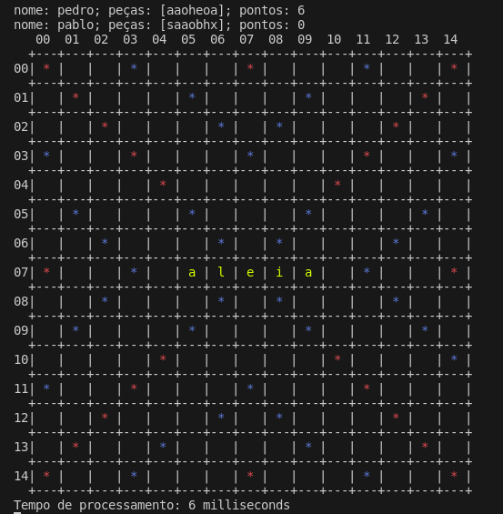
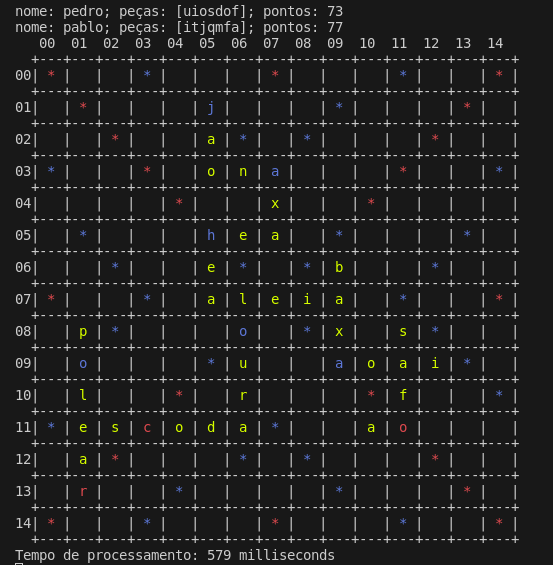

# Grafos1_Scrabot

**Número da Lista**: X<br>
**Conteúdo da Disciplina**: Grafos1, dfs<br>

## Alunos
|Matrícula | Aluno |
| -- | -- |
| 21/2005444  |  Pedro Fonseca Cruz |

## Sobre
O projeto é um programa que consegue jogar o clássico jogo de scrabble (conhecido no brasil como palavras-cruzadas). O jogo consiste em formar palavras utilizando as letras da sua mão e as que já estão no tabuleiro. Aqui está um pequeno video explicando o jogo: https://www.youtube.com/watch?v=PCJiVjmZI8I. Em caso de dúvidas sobre as regras do jogo visite: https://pt.wikipedia.org/wiki/Scrabble. Utilizei uma dfs em um grafo direcionado para a busca de palavras. Usei como base um artigo científico de ANDREW  W. APPEL  AND GUY  J. JACOBSON (pdf do artigo está no repositório, scable.pdf), principalmente para estrutura do grafo. Contudo, não consultei nenhum código de terceiros e toda implementação foi feita por mim.

## Screenshots



## Instalação
**Linguagem**: c++<br>
Nenhum pré-requisito de bibliotecas além da biblioteca base do cpp. Contudo na visualização utilizo linguagem ANSI para as cores no terminal que vão funcionar apenas em sistemas unix. Se tiver windows utilize bash. 

link do passo a passo de instalação: https://www.howtogeek.com/790062/how-to-install-bash-on-windows-11/.

## Uso
apenas compile o código e siga as informações do terminal. Não codifiquei a possibilidade de jogadores humanos, então tem apenas a opção de ver o computador jogar contra ele mesmo.

comandos para compilação pelo terminal:<br>
```console
cd codigos
g++ *.cpp -o scrabot.out
./scrabot.out
```
## Outros
A pasta DICIONARIOS tem um arquivo DicAberto.dict que tem o dicionário que utilizei como base, se tiver dúvida sobre o significado de alguma palavra vá para lá. outros arquivos complementares são a UML do projeto, e o artigo científico scrabble.pdf.